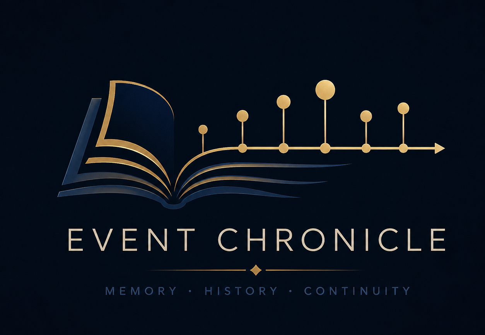
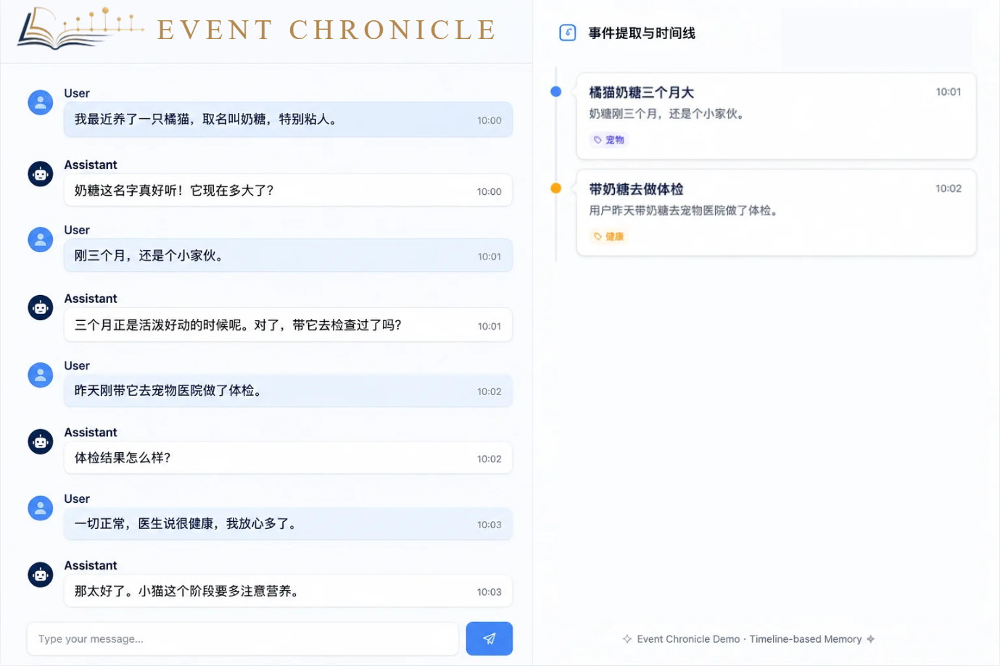

# Event Chronicle




<p align="center">
  <a href="#"></a>
  <a href="#"></a>
  <a href="#"></a>
</p>

---

## 项目简介

> 让对话不只是对话，而是一部持续书写的可视编年史

Event Chronicle 从 AI 对话中提取的事件，而非生成一次性的摘要。它以编年史的方式记录对话中的关键经历、决策、关系变化与重要观点，并按照时间顺序构建可视化的事件时间线

这些事件不仅被长期保存，还能够在未来的对话中被重新检索和注入模型上下文，使 AI 基于历史而非片段摘要进行理解与推理，从而形成更加连贯、可追溯的长期记忆

在 Event Chronicle 中，记忆不再是一段不断被覆盖的总结，而是一条持续延伸的可视历史时间线

### 适用场景

| 场景 | 说明 |
|---|---|
| **SillyTavern** | 酒馆插件中的角色记忆持久化 |

---

## Demo

假设有以下聊天信息



Event Chronicle 不会保存整段聊天，只会从中提取事件

```json
[
  {
    "date": "2026-06-14",
    "event": "用户开始饲养一只三个月大的橘猫，取名为奶糖"
  },
  {
    "date": "2026-06-14",
    "event": "奶糖昨天进行了体检，结果正常"
  }
]
```

这些事件会被保存到编年史中

### 后续对话

后续再次与 AI 对话：

```text
User:
嗯，每天给它准备猫饭，小家伙吃得可欢了。
```

在生成回复之前，Event Chronicle 会将完整编年史注入模型上下文

```text
Event Chronicle

2026-06
├─ 用户开始饲养一只三个月大的橘猫，取名为奶糖
├─ 奶糖昨天进行了体检，结果正常
```

模型正是基于这些历史事件来组织回复——它们构成了 AI 的长期记忆

要理解现在，必须追溯过去

## Quickstart Guide

### 环境要求

- Node.js ≥ 18
- OpenAI 兼容的 API Key

### 安装

```bash
git clone <repo-url>
cd event-chronicle
npm install
cp .env.example .env
# 编辑 .env 填入 LLM_API_KEY
```

### 环境变量

| 变量                      | 必填 | 默认值                      | 说明                          |
| ------------------------- | ---- | --------------------------- | ----------------------------- |
| `LLM_API_KEY`             | ✓    | —                           | LLM API Key                   |
| `LLM_PROVIDER`            |      | `openai`                    | LLM 提供商                    |
| `LLM_BASE_URL`            |      | `https://api.openai.com/v1` | API 地址                      |
| `LLM_MODEL`               |      | `gpt-4o`                    | 模型名称                      |
| `CHRONICLE_EVENT_ID`      |      | —                           | 文件名，存储数据的文件名      |
| `CHRONICLE_MERGE_TRIGGER` |      | `5`                         | 阈值，自动合并触发阈值        |
| `CHRONICLE_MERGE_WINDOW`  |      | `20`                        | 合并时发送给 LLM 的已有事件数 |

### 运行

```bash
# 启动（配置检查 + LLM 初始化 + 提示词预热）
npx tsx index.ts

# 纯函数测试（无需 LLM）
npx tsx test/phase-2/run-phase2.ts

# Exporter 测试
npx tsx test/export/run-exporter.ts

# LLM 集成测试
npx tsx test/phase-2/run-phase2-integration.ts

# E2E 测试（完整管道）
npx tsx test/e2e/run-e2e.ts
```

### 使用示例

```ts
import { startup } from "./index";
import { processMessages } from "./core";
import { exportMemory } from "./core/exporter";

// 1. 启动
await startup({ healthCheck: false });

// 2. 提取事件（自动持久化 + 达到阈值自动合并）
const result = await processMessages(
  [
    { role: "小明", content: "周末去爬西山吧！" },
    { role: "小红", content: "好啊，叫上小刚一起。" },
  ],
  { eventId: "my-story", autoMerge: true },
);
// → { events: [...], storedFile: "my-story.json", merged: false }

// 3. 导出为 LLM 上下文
const memoryPrompt = exportMemory("my-story");
```

---

## 项目思路

```
聊天数据 (Chat Messages)
      │
      ▼
 事件提取 (Extract)      ← LLM 从对话中提取事件
      │
      ▼
 事件编年史 (Chronicle)  ← 按时间组织的客观事件序列
      │
      ▼
 长期记忆 (Memory)       ← 注入 LLM 上下文的可靠历史
```

**核心**：

1. **事件是历史事实** — 只记录已经发生、明确决定、明确推进的事情
2. **时间线是记忆结构** — 按时间组织的事件序列，保持因果关系
3. **记忆不是摘要** — 摘要告诉你聊了什么；记忆告诉你在这些对话中发生了什么

> 史官，不创造事实，不推测事实，不补全事实。Event Chronicle 只记录聊天中明确发生、明确决定、明确推进的事件

---

## 项目架构

```
event-chronicle/
│
├── index.ts                    ← 统一启动入口（startup 函数）
├── .env.example                ← 环境变量配置参考
├── package.json
│
├── config/
│   └── index.ts                ← 环境变量加载与配置导出
│
├── types/
│   └── index.ts                ← 全局类型定义（Event, ChatMessage, MergeInstruction, ...）
│
├── prompts/                    ← 提示词模板（.md 文件，支持 {{变量}} 替换）
│   ├── manager.ts              ← PromptManager：处理提示词加载 / 缓存 / 变量替换
│   ├── extract-event.md        ← 事件提取 Prompt
│   ├── merge-event.md          ← 事件合并 Prompt（指令驱动输出）
│   └── memory-prompt.md        ← Memory Export Prompt 模板
│
├── core/                       ← 核心逻辑
│   ├── index.ts                ← 管道编排：processMessages（extract → store → auto-merge）
│   ├── llm/                    ← LLM 客户端封装
│   │   ├── index.ts            ← initLLM / complete
│   │   └── openai-client.ts   ← OpenAI SDK 封装
│   ├── extractor/              ← 事件提取模块
│   │   ├── index.ts            ← extractEvents（编排 + ID 注入）
│   │   ├── formatter.ts        ← 消息格式化
│   │   └── parser.ts           ← LLM 响应解析
│   ├── merge/                  ← 事件合并模块
│   │   ├── index.ts            ← mergeEvents + applyInstructions
│   │   ├── formatter.ts        ← 事件格式化 + 窗口截取
│   │   └── parser.ts           ← 合并指令解析
│   ├── store/                  ← 数据持久化
│   │   ├── index.ts            ← 统一导出
│   │   ├── loadChronicle.ts    ← 按 eventId 加载
│   │   ├── saveChronicle.ts    ← 全量保存（时间戳命名）
│   │   ├── appendEvents.ts     ← 追加模式（三级 eventId 降级）
│   │   └── mergeState.ts       ← 合并状态追踪（计数器持久化）
│   └── exporter/               ← 导出模块
│       ├── index.ts            ← 统一导出
│       ├── raw-exporter.ts     ← 结构化 JSON 导出
│       └── memory-exporter.ts  ← AI 记忆 Markdown + Prompt 包裹
│
├── test/                       ← 测试
│   ├── phase 1/                ← Phase 1 测试：extract-event 用例
│   │   ├── run-phase1.ts       ← LLM 集成测试
│   │   ├── test-cases-input.json
│   │   └── test-cases-expected.json
│   ├── phase-2/                ← Phase 2 测试：merge 纯函数 + 集成
│   │   ├── run-phase2.ts       ← 纯函数测试（28 用例，无需 LLM）
│   │   ├── run-phase2-integration.ts ← LLM 集成测试
│   │   └── fixtures/           ← 独立 merge 测试用例
│   ├── export/                 ← Exporter 测试
│   │   └── run-exporter.ts     ← 44 项断言
│   ├── e2e/                    ← 端到端测试
│   │   ├── run-e2e.ts
│   │   └── e2e-input.json
│   └── analysis/               ← 测试结果分析报告
│
└── data/                       ← 运行时数据（.gitignore）
    ├── test-01/                ← Phase 1 测试输出
    ├── test-02/                ← Phase 2 测试输出
    └── test-e2e/               ← E2E 测试输出
```

---

## 核心模块说明

### Extractor（事件提取）

从聊天记录中提取状态变化事件。

```
ChatMessage[] → formatMessages → prompt → LLM → parseEvents → injectIds → Event[]
```

| 步骤 | 说明 |
|---|---|
| `formatMessages` | 将 `{role, content}` 数组转为 `角色名:\n内容` 格式 |
| Prompt | `extract-event.md`，通过 `PromptManager.getWithVars` 注入变量 |
| LLM | 调用 `complete()` 获取 JSON 事件数组 |
| `parseEvents` | 解析 LLM 响应，剥离代码块，JSON.parse |
| `injectIds` | 程序侧注入 `evt_{timestamp}_{random6hex}` 唯一 ID |

```ts
import { extractEvents } from "./core/extractor";

const events = await extractEvents(messages, JSON.stringify(existingEvents));
// [{ id: "evt_1718000000_a1b2c3", title: "进入古老图书馆", ... }, ...]
```

### Merge（事件合并）

> 整理编年史

通过 LLM 分析已有事件和新事件，输出**指令**驱动数据变更（而非输出全量事件 JSON）。

```
existingEvents + newEvents → applyWindow → formatEvents → prompt → LLM
  → parseInstructions → applyInstructions → Event[]
```

**四种指令**：

| Action | 作用 | 示例 |
|---|---|---|
| `update` | 修改已有事件（升级/补充信息） | `{ action: "update", id: "evt_x", changes: { title: "新标题" } }` |
| `delete` | 删除冗余事件（去重） | `{ action: "delete", id: "evt_x" }` |
| `add` | 追加全新事件 | `{ action: "add", event: { ... } }` |
| `keep` | 无操作（隐式兜底） | `{ action: "keep" }` |

**为什么需要事件合并**：连续提取可能产生描述同一状态变化的不同版本。合并确保编年史中不重复、不矛盾、信息完整。

**触发策略**：累计新增 N 条事件后自动触发（`CHRONICLE_MERGE_TRIGGER`，默认 5）。合并不随每次提取触发，控制 LLM 调用频率。

### Storage（数据持久化）

以 JSON 文件存储于 `data/` 目录。

| 函数 | 说明 |
|---|---|
| `loadChronicle(eventId?)` | 按 eventId 加载 `data/{eventId}.json` 数据 |
| `saveChronicle(events)` | 全量保存到 `data/event_{timestamp}.json` |
| `appendEvents(events, eventId?)` | 追加模式，三级 eventId 降级（显式 → env → 时间戳） |
| `mergeState` | 合并计数器持久化，程序重启不丢失 |

### Exporter（事件导出）

纯表达层模块，不修改事件数据。

| 导出模式 | 函数 | 输出 |
|---|---|---|
| **Raw Export** | `exportRaw(eventId)` | 完整 JSON 数组（数据迁移/调试） |
| **Memory Export** | `exportMemory(eventId)` | Markdown + Prompt 包裹（直接注入 LLM） |

两层 API：

```ts
// 上层：传 eventId（内部自动加载）
exportRaw("my-story");
exportMemory("my-story", { highlightThreshold: 6 });

// 底层：传 Event[]（纯函数，供测试）
exportRawFromEvents(events);
exportMemoryFromEvents(events, { groupBy: "tags" });
```

---

## 副作用

1. 每轮对话的 token 增加（记忆会注入到 LLM API 中）
2. token 逐步递增：随着对话轮次增加，事件不断累积，记忆愈加厚重，token 开销也随之加大
3. LLM API 的请求次数相应增多：每 N 次对话触发一次事件提取，每生成 M 个事件则请求一次事件整理与合并（N、M 可配置）

---

## 扩展

若导入 TA 的“历史”，AI 是否是 TA 的一种延续呢？

---

## License

MIT
